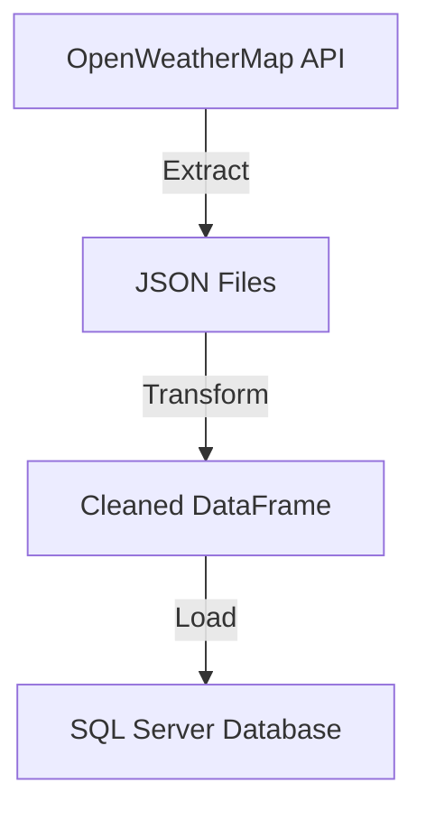

# 🌤️ ETL Weather Data Pipeline – OpenWeather API to MS SQL Server

This project demonstrates a full ETL (Extract, Transform, Load) pipeline that collects real-time weather data from the [OpenWeatherMap API](https://openweathermap.org/api), transforms it into a clean tabular format, and loads it into a **local Microsoft SQL Server** instance running in Docker.

- [🌤️ ETL Weather Data Pipeline – OpenWeather API to MS SQL Server](#️-etl-weather-data-pipeline--openweather-api-to-ms-sql-server)
  - [📦 Project Structure](#-project-structure)
  - [🚀 How It Works](#-how-it-works)
  - [📊 Data Flow Diagram](#-data-flow-diagram)
  - [🚀 Quick Start](#-quick-start)
  - [🔧 Setup Instructions](#-setup-instructions)
    - [🐍 1. Python Environment](#-1-python-environment)
    - [🔐 2. Environment Variables](#-2-environment-variables)
    - [🐳 3. Run SQL Server in Docker](#-3-run-sql-server-in-docker)
    - [💻 4. Database Driver Setup](#-4-database-driver-setup)
      - [For macOS Users](#for-macos-users)
      - [For Windows Users](#for-windows-users)
      - [For Linux Users](#for-linux-users)
    - [📊 5. Initialise Database](#-5-initialise-database)
    - [▶️ 6. Running the ETL Pipeline](#️-6-running-the-etl-pipeline)
  - [🛠 Troubleshooting](#-troubleshooting)
    - [SQL Server Connection Issues](#sql-server-connection-issues)
    - [Airflow DAG Not Showing in UI](#airflow-dag-not-showing-in-ui)
    - [Missing Environment Variables](#missing-environment-variables)
  - [🌀 Optional: Orchestrating with Apache Airflow](#-optional-orchestrating-with-apache-airflow)
    - [1. Install Apache Airflow](#1-install-apache-airflow)
    - [2. Start Airflow Standalone](#2-start-airflow-standalone)
    - [3. Add the DAG File](#3-add-the-dag-file)
    - [4. Enable and Trigger the DAG](#4-enable-and-trigger-the-dag)
  - [🔄 Extending the Pipeline](#-extending-the-pipeline)
    - [Adding New Cities](#adding-new-cities)
    - [Integrating Additional APIs](#integrating-additional-apis)
  - [🛠 Tech Stack](#-tech-stack)
  - [🧪 Example SQL Queries](#-example-sql-queries)
  - [🔍 Understanding ODBC](#-understanding-odbc)
  - [🤝 Contributing](#-contributing)
  - [📄 License](#-license)
  - [🙌 Acknowledgements](#-acknowledgements)

---

## 📦 Project Structure

```plaintext
ETL Python Project
├── extract/
│   ├── get_weather_json.py       # Extracts data from OpenWeather API
├── load/
│   ├── load_to_msserver.py       # Loads cleaned data into MS SQL Server
├── transform/
│   ├── clean_json_weather.py     # Cleans and flattens JSON data
├── scripts/
│   └── setup_database.py         # Initializes database and table
├── run_etl_pipeline.py           # Orchestration: runs extract, transform, load
├── requirements.txt              # Python dependencies
├── README.md                     # Project documentation
└── .env                          # Environment variables (not tracked in Git)
```

---

## 🚀 How It Works

1. **Extract**  
   `get_weather_json.py` uses the OpenWeatherMap API to get current weather data for a list of cities and saves each response as a JSON file in `extract/`.

2. **Transform**  
   `clean_json_weather.py` flattens nested JSON, handles missing values, and enforces data types.

3. **Load**  
   `load_to_msserver.py` inserts the cleaned data into a local SQL Server table called `weather_data`.

4. **Orchestration**  
   `run_etl_pipeline.py` ties all steps together and runs the full ETL pipeline.

---

## 📊 Data Flow Diagram



---

## 🚀 Quick Start

1. Clone the repository:

   ```bash
   git clone <repository-url>
   cd python-etl-project
   ```

2. Set up the environment:

   ```bash
   python -m venv venv
   source venv/bin/activate
   pip install -r requirements.txt
   ```

3. Configure `.env` with your OpenWeatherMapAPI key and SQL Server database credentials.

4. Start the SQL Server Docker container:

   ```bash
   docker run -e 'ACCEPT_EULA=Y' -e 'SA_PASSWORD=YourStrong!Passw0rd' \
     -p 1433:1433 --name sql_server_container \
     -d mcr.microsoft.com/mssql/server:2019-latest
   ```

5. Install the ODBC Driver 17 for SQL Server:

   - **Windows**: Typically pre-installed.

   - **Mac/Linux**: Follow the setup guide in the "Setup Instructions" section.

6. Initialise the database:

   ```bash
   python scripts/setup_database.py
   ```

   This will create the `weather_db` database and the `weather_data` table if they do not already exist.

7. Run the ETL pipeline:

   ```bash
   python run_etl_pipeline.py
   ```

   Upon success, the weather_data table should now contain the current weather for the different cities.

8. (Optional) Use Apache Airflow for orchestration rather than manually running via run_etl_pipeline.py.

---

## 🔧 Setup Instructions

### 🐍 1. Python Environment

```bash
python -m venv venv
source venv/bin/activate
pip install -r requirements.txt
```

### 🔐 2. Environment Variables

Create a `.env` file in the project root:

```env
API_KEY=your_openweather_api_key
MSSERVER_USER=YOURUSERNAME
MSSERVER_PASSWORD=YourStrong!Passw0rd
```

✅ Tip: Add this file to your .gitignore - never commit secrets to GitHub!

### 🐳 3. Run SQL Server in Docker

```bash
docker run -e 'ACCEPT_EULA=Y' -e 'SA_PASSWORD=YourStrong!Passw0rd' \
  -p 1433:1433 --name sql_server_container \
  -d mcr.microsoft.com/mssql/server:2019-latest
```

✅ Verify the container is running:

```bash
docker ps | grep sqlserver
```

### 💻 4. Database Driver Setup

#### For macOS Users

1. Install Homebrew if you haven't already:

   ```bash
   /bin/bash -c "$(curl -fsSL https://raw.githubusercontent.com/Homebrew/install/HEAD/install.sh)"
   ```

2. Install Microsoft ODBC Driver:

   ```bash
   brew tap microsoft/mssql-release https://github.com/Microsoft/homebrew-mssql-release
   brew update
   brew install msodbcsql17
   ```

#### For Windows Users

- The ODBC driver is typically pre-installed
- If needed, download from [Microsoft's website](https://learn.microsoft.com/en-us/sql/connect/odbc/download-odbc-driver-for-sql-server)

#### For Linux Users

```bash
curl https://packages.microsoft.com/keys/microsoft.asc | apt-key add -
curl https://packages.microsoft.com/config/ubuntu/$(lsb_release -rs)/prod.list > /etc/apt/sources.list.d/mssql-release.list
apt-get update
ACCEPT_EULA=Y apt-get install -y msodbcsql17
```

### 📊 5. Initialise Database

⚠️ **Prerequisites**:

- Docker must be running
- SQL Server container must be up and accessible
- ODBC driver must be installed

Run the setup script to create the database and table:

```bash
python scripts/setup_database.py
```

This will:

- Create the `weather_db` database if it doesn't exist
- Create the `weather_data` table with the correct schema
- Handle any setup errors gracefully

### ▶️ 6. Running the ETL Pipeline

```bash
python scripts/run_etl_pipeline.py
```

You'll see logs for each city being fetched, transformed, and loaded into your SQL Server database.

---

## 🛠 Troubleshooting

### SQL Server Connection Issues

- **Error**: `pyodbc.InterfaceError: ('IM002', '[IM002] [Microsoft][ODBC Driver Manager] Data source name not found')`
  - **Solution**: Ensure the ODBC driver is installed and the SQL Server container is running.

### Airflow DAG Not Showing in UI

- **Error**: DAG file is not visible in the Airflow UI.
  - **Solution**: Ensure the DAG file is in the `~/airflow/dags/` directory and restart the Airflow webserver.

### Missing Environment Variables

- **Error**: `KeyError: 'API_KEY'`
  - **Solution**: Ensure the `.env` file is correctly configured and loaded.

---

## 🌀 Optional: Orchestrating with Apache Airflow

You can use Apache Airflow to schedule and monitor the ETL pipeline. Follow these steps:

### 1. Install Apache Airflow

Install Airflow in your Python environment using PIP:

```bash
pip install apache-airflow
```

### 2. Start Airflow Standalone

Run the following command to start Airflow in standalone mode:

```bash
airflow standalone
```

This will:

- Initialise the Airflow database.
- Start the Airflow scheduler and webserver.
- Create a default admin user - see terminal for credentials.

Access the Airflow UI at [http://localhost:8080](http://localhost:8080).

### 3. Add the DAG File

The DAG (Directed Acyclic Graph) file defines the workflow for your ETL pipeline in Airflow. It specifies the sequence of tasks (e.g. extract, transform, load) and their dependencies. In this project, the DAG file is named `etl_pipeline_dag.py` and includes the following:

- **Tasks**:
  - `extract`: Fetches weather data from the OpenWeatherMap API and saves it as JSON files.
  - `transform_and_load`: Cleans the JSON data and loads it into the Microsoft SQL Server database.

- **Dependencies**:
  - The `transform_and_load` task depends on the successful completion of the `extract` task.

- **Schedule**:
  - The DAG is configured to run daily (`@daily`), but you can adjust the schedule as needed.

- **Location**:
  - Place the `etl_pipeline_dag.py` file in the Airflow `dags/` directory (default: `~/airflow/dags/`).

### 4. Enable and Trigger the DAG

1. In the Airflow UI, locate the `etl_pipeline` DAG.
2. Toggle the switch to enable it.
3. Trigger the DAG manually or let it run on schedule.

---

## 🔄 Extending the Pipeline

### Adding New Cities

1. Update the list of cities in `get_weather_json.py`.
2. Ensure the city names are consistent across the pipeline.

### Integrating Additional APIs

1. Add a new script in the `extract/` folder to fetch data from the new API.
2. Update the `transform/` and `load/` scripts to handle the new data format.
3. Modify the DAG file to include the new tasks.

---

## 🛠 Tech Stack

- Python 3
- Pandas
- Requests
- SQLAlchemy
- pyodbc
- Microsoft SQL Server (via Docker)
- OpenWeatherMap API
- python-dotenv
- **Apache Airflow** (optional for orchestration)

---

## 🧪 Example SQL Queries

```sql
-- Get latest temperatures
SELECT city, temp, datetime_utc
FROM weather_data
ORDER BY datetime_utc DESC;

-- Average humidity per city
SELECT city, AVG(humidity) AS avg_humidity
FROM weather_data
GROUP BY city;
```

---

## 🔍 Understanding ODBC

ODBC (Open Database Connectivity) is a standard database access method that allows applications to communicate with database management systems. In this project:

1. **What is ODBC?**
   - A universal database interface
   - Allows Python to talk to SQL Server
   - Handles connection, authentication, and data transfer

2. **Why ODBC Driver 17?**
   - Official Microsoft driver for SQL Server
   - Supports modern SQL Server features
   - Required by pyodbc for database connections

3. **Common Issues:**
   - Driver not found: Ensure ODBC driver is installed
   - Connection errors: Check Docker is running
   - Authentication issues: Verify .env credentials

---

## 🤝 Contributing

Feel free to fork the repo and suggest improvements. Pull requests are welcome!
Please follow conventional Python formatting (black, flake8) and keep functions modular.

---

## 📄 License

MIT License. You are free to use and adapt this for personal or professional learning projects.

---

## 🙌 Acknowledgements

- OpenWeatherMap API: For providing real-time weather data.
- Microsoft SQL Server Docker Images: For enabling a local SQL Server instance.
- Microsoft ODBC Driver Team: For the ODBC driver used to connect Python to SQL Server.
- Apache Airflow: For providing a robust platform to orchestrate and monitor the ETL pipeline.
